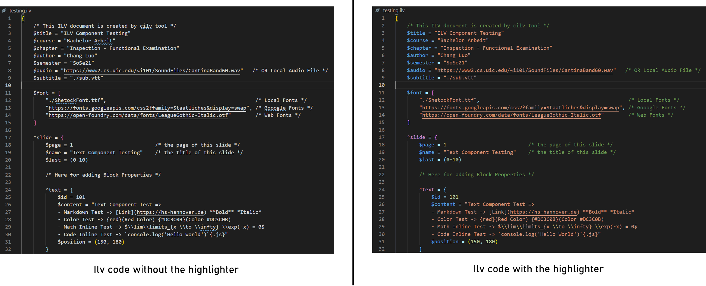

# ILV - Interactive Learning Video Authoring Tool 
This project is developed based on my thesis which introduces the use of markup language to edit interactive learning videos instead of the traditional WYSIWYG editing.

## Live Demo
Here is a [live demo](http://chang-ba.herokuapp.com/) generated by the testing.ilv.

## TL;DR

### Install 
```bash
npm install @netbeifeng/ilv-interactive-video-authoring-tool -g
```
Please execute the `cilv version` command to test whether the tool is correctly installed, and this command will help you to install the necessary dependency `concurrently` globally.

### Template
You can execute the command `cilv init <project_name>` to initialize an ILV document by using the template.

### Deploy and Debugging
The command `cilv deploy <project_name>` is employed to parse the given ilv document and deploy it to the localhost webserver.
The webserver is hosted by React. Concurrently, a listener will be added to the given ilv file, if something triggers a content change,
the parsing will restart and project will be re-deployed to the webserver, so that the author can see the changes immediately.

## Highlighter
Since ILV markup language is a custom language, I developed a syntax highlighter for it to enhance the coding experience and code readability,
available in Visual Studio Marketplace -> [here](https://marketplace.visualstudio.com/items?itemName=aliasILV.ilv).
Or install with CLI `code --install-extension aliasILV.ilv`
Here is the display effect before and after using the highlighter.


## Structure
- [cli](https://github.com/netbeifeng/bachelor-thesis-chang-2021-interactive-video-authoring-tool/tree/main/cli) -> Source code of CILV cli tool
- [highlighter](https://github.com/netbeifeng/bachelor-thesis-chang-2021-interactive-video-authoring-tool/tree/main/highlighter/ilv) -> Source code of vscode highlighter
- [parser](https://github.com/netbeifeng/bachelor-thesis-chang-2021-interactive-video-authoring-tool/tree/main/parser) -> Source code of ilv parser
- [validator](https://github.com/netbeifeng/bachelor-thesis-chang-2021-interactive-video-authoring-tool/tree/main/validator) -> Source code of json validator
- [components](https://github.com/netbeifeng/bachelor-thesis-chang-2021-interactive-video-authoring-tool/tree/main/src/components) -> React components 
- [utilities](https://github.com/netbeifeng/bachelor-thesis-chang-2021-interactive-video-authoring-tool/tree/main/src/utilities) -> ILV Object TypeScript defintion
- [testing](https://github.com/netbeifeng/bachelor-thesis-chang-2021-interactive-video-authoring-tool/tree/main/testing) -> Testing.ilv document

## ILV Markup Language
Here is an examplar of ILV document.

A valid document should enclosed with a pair of braces, which called `RootProperty`.

There are two types of properties in an ILV document, the `InlineProperty` and the `BlockProperty`.
The `InlineProperty` starts with the dollar character ($), and the `BlockProperty` starts with the circumflex symbol (^). The former is used to defined variable within the latter one. Here is an example. The key of the Property is pre-defined, and for each component possesses individual keys. 
To learn which keys can be used on which components, please read section C in the appendix of my paper.

```
^slide = { /* This is a BlockProperty */
    $page = 1 
    $name = "Slide 1" /* These two are InlineProperty*/
}
```

The following `InlineProperty` must be defined within the `RootProperty`. 

|  |title|course|chapter|author|semester|audio|subtitle*|font*|
|---|---|---|---|---|---|---|---|---|
|type|String|String|String|String|String|String|String|Array|

An entire example of ILV document, please refer to the [testing.ilv](https://github.com/netbeifeng/bachelor-thesis-chang-2021-interactive-video-authoring-tool/blob/main/testing/testing.ilv) document in the testing directory.
